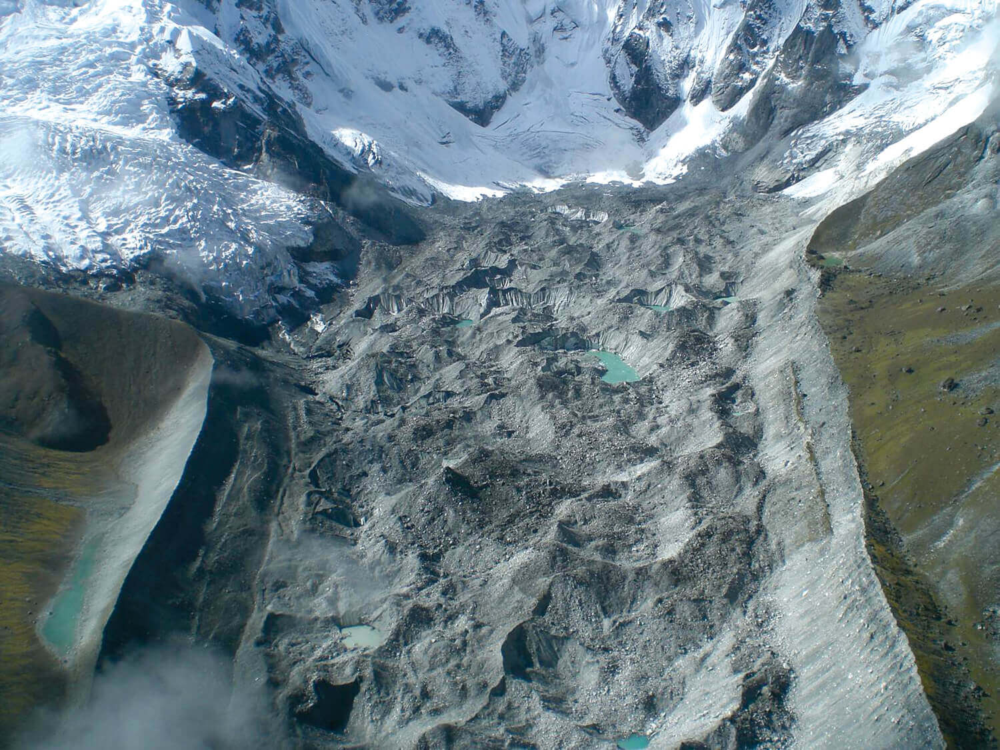
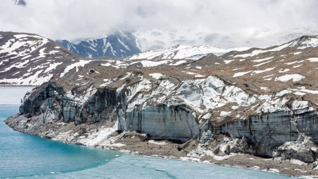
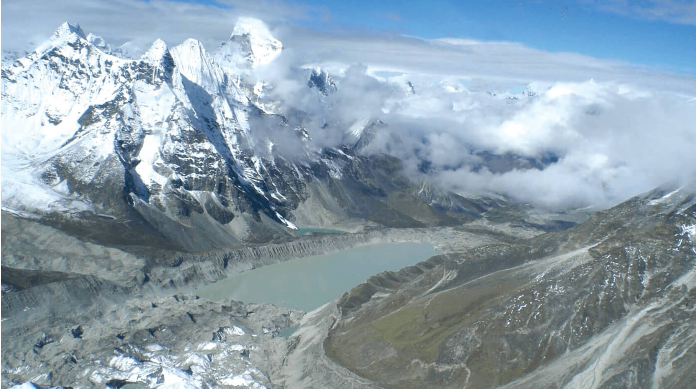

```{r setup, include=FALSE}
library(knitr)
require(tidyverse)
set.seed(453)
# invalidate cache when the package version changes
knitr::opts_chunk$set(tidy = FALSE, echo = FALSE, 
                  message = FALSE, warning = FALSE,
                  out.width = "45%")
options(knitr.table.format = "latex")
options(knitr.kable.NA = "", digits = 2)
options(kableExtra.latex.load_packages = FALSE)
```

# General impacts

## 

```{r climate-change-glacier, out.width="70%", fig.align='center'}

```

## For higher latitudes

- Some species of vegetation require not only a stable climate but a narrow range of meteorological extremes such as high and low temperatures, precipitation, and soil moisture. 
- The Intergovernmental Panel on Climate Change, created by the United Nations in 1988, has concluded that over the next 50 years projected changes in regional temperatures and precipitation could cause climatic zones to shift hundreds of kilometers toward the polar regions. 
- Some biotic communities may be capable of adapting to a climatic shift of such magnitude, while others would experience substantial loss that could include some species extinction.
- In higher altitutes, impacts for forest line.
- the permafrost that presently underlies the 20–25% of the Northern Hemisphere that is perenially frigid may begin to thaw during the next 40–50 years. Degradation of the permafrost cover would damage high-latitude surface ecosystems, destabilize terrain, and cause soil erosion.

##

```{r climate-change-everest, out.width="70%", fig.cap="Melting of Himalayan glacial cover"}

```

## To crops

- Major effects due to increasing concentration of $CO_2$. The level of atmospheric $CO_2$ in Europe has increased from about $280 \mu mol~\mathrm{CO_2}~mol^{-1}$ before the industrial era to $358 \mu mol$ $\mathrm{CO_2}~mol^{-1}$ in 1995 . 
- This trend is expected to continue and result in an increase to over $700~\mu~mol~mol^{-1}$ by the end of the next century if no steps are taken to limit emissions. 
- In parallel with the recent trend of rising atmospheric [$CO_2$], ozone ($O_3$) also has increased and is regarded as being one of the most phytotoxic of the air pollutants commonly encountered in the developed countries of the Northern Hemisphere.

##

- Plants respond to elevated $CO_2$ levels by:
  - Changes in growth and yield
  - Structure and anatomy
  - Photosynthetic and respiratory gas exchange
  - C and N assimilation
  - Transpirational and water use efficiency and hence turgor pressure
- Phytotron experiments, Free air $CO_2$ enrichment (FACE) technique.
- Among the wide range of $C_3$ species that have been examined, including virtually all crop and forest species of northern latitudes, the photosynthesis of some 95% is not saturated by the present [$CO_2$]. $C_3$ plants require 800–1000 $\mu~mol~mol^{-1}~CO_2$ for saturation of photosynthesis. Almost all show significant increases in photosynthesis and dry matter production in response to an increase in [$CO_2$] of between 500 and 1000 $\mu~mol~mol^{-1}~CO_2$. A doubling of [$CO_2$] from 330 to 660 $\mu~mol~mol^{-1}~CO_2$ increases the productivity of crops and $C_3$ plants by 33–41% .

## 

- Although the net photosynthesis assimilation increases by an average of 50% in the short term, the plant weight increases by only 40% over a long period. Such stimulation is modest compared with what might be expected on the basis of short-term increases in carbon fixation at high [$CO_2$]. Also, there is much evidence that the initial $CO_2$ stimulation of photosynthesis is not maintained and that downregulation of photosynthesis caused by acclimation occurs after prolonged exposure to high $CO_2$ concentration.
- Increases above ground biomass in wheat, faba bean, however no significant change in HI.

# Specific impacts

## In rice

- The sensitivity of rice reproductive growth stages in terms of yield reduction or sensitivity to drought was ranked in the following order: (a) flowering, (b) gametogenesis, (c) panicle initiation, and (d) grain fill.
- Drought stress reduces biomass accumulation both at ambient and elevated $CO_2$ levels.
- Carbon dioxide enrichment significantly increased both the canopy net photosynthetic rate and water-use efficiency, whereas reducing evapotranspiration by about 10%. This water saving under [$CO_2$] enrichment allowed photosynthesis to continue for about 1–2 days longer during drought in the enriched compared with the ambient [$CO_2$] control treatment. 
- These results indicate that, in the absence of other potential climate change factors, such as increased air temperature, rice grown in the next century may use less water, use water more efficiently, and become better able to avoid drought in some situations.

## Climate change threats to glacial region of Hindu Kush Himalayas 

- Even if the world limits the temperature rise to 1.5$^\circ C$ this century, at least one third of the ice would go^[Climate change poses a growing threat to the glaciers found in the Hindu Kush and Himalayan mountain ranges].
- The glaciers are a critical water source for 250 million people living across eight different countries. 
- Impacts on people in the region, already one of the world's most fragile and hazard-prone mountain regions, will range from worsened air pollution to an increase in extreme weather events.
- The HK region covers some 3,500km across Afghanistan, Bangladesh, Bhutan, China, India, Myanmar, Nepal and Pakistan.
- Glaciers feed world's most important river systems.
- Impact for the 1.65 billion people living in the river valleys below, with rising vulnerability to flooding and destruction of crops.

##

- Himalayan peaks are warming between 0.3 to 0.7$^\circ C$ faster than the global average,
- Measurements show that glaciers in the Central and Eastern Himalaya are shrinking at 40cm/year, and some are receding up to 30m/year^[[Terrifying assessment of himalayan melting](
https://www.nepalitimes.com/banner/a-terrifying-assessment-of-himalayan-melting/)].
- The hydro-meteorological impact of climate change will go beyond countries like Nepal or Bhutan.

## Nepal's fragility

- Largely fed by South Asian Monsoon system, but the mountainscape and the orographic rainfall pattern are intimately related.
- Dramatic variation in altitudinal differences over a short distance complicates the precipitation dynamics.
- Meteorological information system and hydrological set ups are poor and very limited in their information value.
- The diversity in Nepal's climate is matched by the diversity of its multiple ecosystems and flora and fauna species. 
- Each of these many socio-economic systems is custom-tailored to take advantage of the opportunities offered by specific micro-climates and localised ecosystems and to respond to the constraints they impose on livelihoods. 

##

- The livelihoods of over three-quarters of all Nepalis are based on agriculture and forest resources, and almost 65 percent of agriculture is rain-fed (MoPE, 2000).  
- Yet only 21 % of Nepal's area is cultivable and the irrigable agriculture depends on the types of local surface sources, most likely to be affected by erratic rainfall.
- Country hosts more than 6,000 rivers and rivulets, with a total of 45,000 km in length, support irrigated agriculture and other livelihoods. Rivers wreak havoc in valleys and in the tarai when they overflow. 
- There are 2323 glacial lakes covering 75 sq. km area.
- Rice based food system provides for much of the staple in Hills and Terai^[https://kathmandupost.com/money/2018/08/31/bumper-paddy-crop-expected-this-year].
- As regions become drier, Nepalese forest cover of 40% is at increased risk of fire. Already, in the spring of 2009, smoke from fires blanketed much of the Himalaya, from Kashmir in the west to Meghalaya in the east.

##

- Himalayas and hills have young soils, due to flashy runoff and debris flow after precipitation, fertility of upper region decends immediately.
- In mostly the flooded plains and downstream sites of landslides, sediment transfer will render land uncultivable.
- Shifting river channels often inundate arable fields and occassionally breach the embankments to completely sweep away the fertile basins.
- Long term impacts on himalayan livelihood that depends on NTFPs; loss of forest, poorer water supplies. Lesser groundwater recharge owing to lesser forest coverage.
- With lack of forest supplies and ebb in vegetation or wildlife divesity in forests or largely natural spaces, wildlife will face habitat disruption and might more freqently meet with human trespassing.

##

```{r imja-lake-receding, fig.cap="Receding imja lake at Mount Everest region", out.width="65%"}

```


# Assessment and projections

##

- Mirza and Dixit (1997) found that climate change in the Ganga and Brahmaputra basins is likely to change river flows, which in turn will affect low flows, drought, flood and sedimentation processes. 
- In 1999 Shrestha et al. suggested that temperatures are increasing in Nepal and that rainfall is becoming more variable. 
- In 2009, a modeling exercise conducted by team of Nepali, American, British, Pakistani and Bangladeshi experts (NCVST,2009) using the emissions scenarios in the IPCC's special report (2007) found that the temperature will indeed increase in the mid-hills and that this region is likely to grow more arid in the non-monsoon seasons.

##

- During 2008-2008 winter drought, most monitoring stations received less than 50% of normal rainfall, 30% recorded no precipitation at all and temperatures were 1-2$^\circ C$ above average. At the national level, wheat and barley production decreased by 14.5% and 17.3% respectively and the 2009 maize production was also seriously affected. 
- Global circulation model (GCM) projections indicate:
  - that the temperature over Nepal will increase between 0.5$^\circ C$ and 2.0$^\circ C$ with a multi-model mean of 1.4$^\circ C$, by the 2030s and between 3.0$^\circ C$ and 6.3$^\circ C$, with a multi-model mean of 4.7$^\circ C$, by the 2090s. GCM outputs suggest that extremely hot days (the hottest 5% of days in the period from 1970 to 1999) are projected to increase by up to 55% by the 2060s and up to 70% by the 2090s.
  - that extremely hot nights (the hottest 5% of nights in the period from 1970 to 1999) are projected to increase by up to 77% by the 2060s and 93% by the 2090s.
  - a wide range of precipitation changes, especially during the monsoon: from a decrease of 14% to an increase of 40% by the 2030s and from a decrease of 52% to an increase of 135% by the 2090s.

# Expectations and measures

## Expectations

- Floods and landslides are rapid onset disasters
- Aridity and drought, forest fires, snow melt, regional sedimentation steady onset disasters.
- GLOF and bishyari variants of flood
- In many well adapted systems, people might actually "do well", despite changing conditions.
- But what about the resilience of mountain livelihood in Nepal?

## Mitigation measures

- Should take into account unique interplay among physical, social, economic and political relationships. 
- The ability to reduce vulnerability to disasters is related to the robustness of the systems
- Livelihood diversification, disaster response and recovery mechanism.
- Political and institutional measures; Carbon taxation, carbon pricing.

# Bibliography

```{r bib, include=FALSE}
# create a bib file for the R packages used in this document
# knitr::write_bib(c('base', 'rmarkdown'), file = '../skeleton.bib')
```
