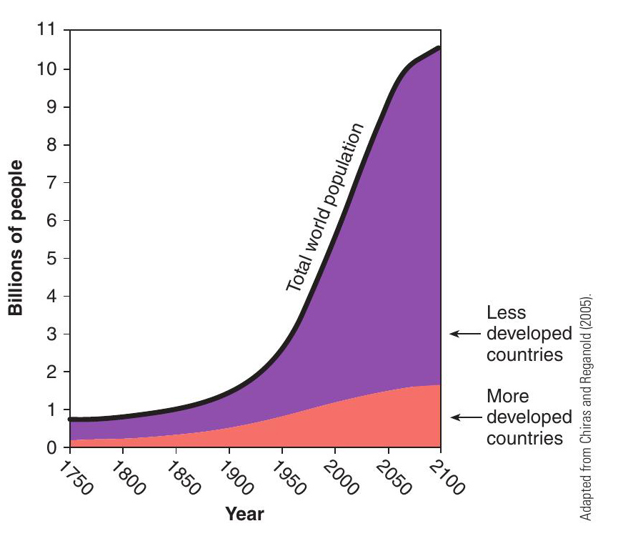
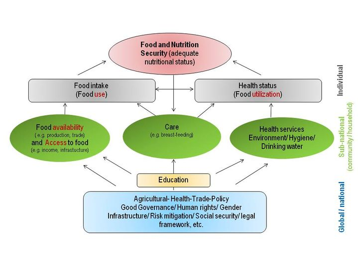
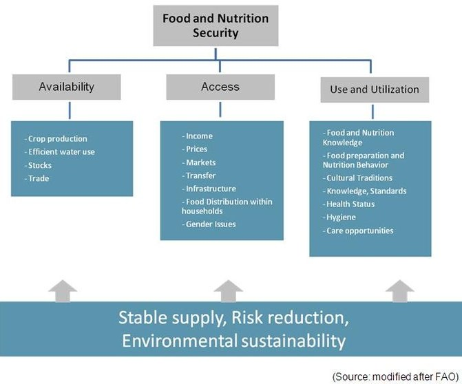

```{r setup, include=FALSE}
library(tufte)
# invalidate cache when the tufte version changes
knitr::opts_chunk$set(tidy = FALSE, cache.extra = packageVersion('tufte'), 
                      echo = FALSE)
options(htmltools.dir.version = FALSE)
```

# Background

Food is a fundamental human right. That leads to food security being one of the greatest challenges facing the world today. 

> _"Food security is the issue of our time."_
>
> `r tint::quote_footer("--- Hillary Clinton")`

It is predicted that food production must increase by at least 70% before 2050 to support continued population growth, although the size of the world's agricultural area will remain essentially the same [@connor2011crop]. It is projected that global population will reach from 6.8 billion in 2010 to 9.2 billion by 2050. The exponential patterns of world population growth since the 1800s are due to better nutrition resulting from increased food availability, combined reduction of mortality due to improved sanitation, water purification, and medicine. This increased demand for food must be met mostly from yield (productivity) increase on existing cropland.

```{r world-pop, fig.cap="World population projections", fig.width=5, cache=TRUE, out.width="75%"}
# pdftools::pdf_convert("./../Introduction-to-Agronomy-Food-Crops-and-Environment.pdf", pages = 85, format = "jpeg", dpi = 250)

```


Though localized famine has occurred in some regions of the world, the global catastrophic events predicted by Malthus and Ehrlich have not occurred. This is due in part to continued advancements in agriculture that have increased food supplies. Still, more recently, Norman Borlaug (1904-2009), a leader of developing improved wheat varieties to feed the world, declared in his 1970 Nobel Peace Prize speech, 

> _"If the world population continues to increase at the same rate, we will destroy the species."_
>
> `r tint::quote_footer("--- Norman Borlaug, 1904-2009")`

In a world where we produce enough food to feed everyone, 815 million people - one in nine - still go to bed on an empty stomach each night^[[FAO, IFAD and WFP 2014](http://www.fao.org/publications/sofi/2014/en/)]. Though the world has an abundance of food, not everyone has the opportunity to purchase it. More than a billion people in the world live in poverty, which is concentrated in developing countries. Although at a global scale the rate of food production is high, the food available for consumption is not evenly distributed, and 1.02 billion people in 2009 -- 17% of world's population -- face food insecurity. Cereal production in 2008 was at record highs, while at the same time a record number of the world's population was hungry. Food insecurity is pervasive, everywhere.

# What is Food security?

Food security is defined by the Food and Agriculture Organization [FAO](http://www.fao.org/) as:

> _"when all people, at all times, have physical, social and economic access to sufficient, safe and nutritious food that meets their dietary needs and food preferences for an active and healthy life."_
>
> `r tint::quote_footer("--- Rome Declaration agreed at the World Food Summit, 1996")`

`r tint::margin_note("\\textbf{Hidden hunger}\\newline There is also a more insidious type of hunger, a hidden hunger caused by deficiencies in micronutrients such as iron, Vitamin A and Zinc affecting two billion people.")`

# Why is Food security concerning?

- The economic costs of micronutrient deficiencies are considerable, reducing gross domestic product (GDP) by 0.7-2% in most developing countries.
- Global losses in economic productivity due to macronutrient and micronutrient deficiencies reach more than 2-3% of GDP.
- GDP growth generated by agriculture is up to four times more effective in reducing poverty than growth generated by other sectors^[[IFAD 2012](http://www.ifad.org/hfs/index.htm)]
- A 1% increase in agricultural yields leads to a 0.6-1.2% reduction in the number of people living below $1 per day^[[Thirtle 2003](http://www.sciencedirect.com/science/article/pii/S0305750X03001682)].
- Nepal is enlisted as one of the world's most productive food production systems [@connor2011crop]. Although it highlights the role of Nepal and regions-alike in leading global food security movement, challenges remain that farmers themselves are the most vulnerable communities in developing countries, with regard to fulfillment of food secure status.

## Nutrition aspect of food security

The nutritional aspect of food and nutrition security is achieved when secure access to food is coupled with a sanitary environment, adequate health services, and knowledgeable care to ensure a healthy and active life (free from malnutrition) for all household members.

In their `r tint::newthought("1998 paper")`^[[The state of world's children: Focus on nutrition](https://www.unicef.org/sowc98/silent4.htm)], UNICEF has highlighted the nutrition aspect of food security. The nutritional dimension is integral to the concept of food security^[[Committee on World Food Security (CFS), Global Strategic Framework for Food Security and Nutrition, 2011](http://www.fao.org/fileadmin/templates/cfs/Docs1011/WG_GSF/GSF_annotated_outline_formatted_Rev1_22_Jun_11.pdf)].

```{r nutrition-aspect, fig.width=6, fig.cap="Aspects of food and nutrition security", cache=TRUE, out.width="75%", fig.fullwidth = TRUE}

```

Different factors and sectors on the global/national level. At global level some or all of the following have prominent role: 

1. The extent of agricultural production
2. Existing infrastructure
3. International policies
4. Gender issues 
5. Trade facilitation

Some factors impact more or less directly the community and household. At national and sub-national level, following factors determine the state of food and nutrition security: 

1. Education
2. Health services
3. Environmental condition
4. Hygienic conditions
5. Local infrastructure
6. Harmonization of national agricultural policies
7. Support to the national Special Programs for Food Security.

Improved food availability and access to food, along with aspects of care, determine the individual's food intake (*food use*); whereas care and questions of health and hygiene influence the individual's health status (*food utilisation*). Food intake and health status are closely related to each other and both determine the level and overall goal of food and nutrition security.

## Regionality of food security

At regional and national levels, the key objective is to ensure the availability of food of acceptable quality. Food availability may be assured through a combination of domestic production and regional and international trade. Successful overall development is the best way of promoting overall food availability. 
National level food security is not synonymous with food self-sufficiency and the promotion of self-sufficiency may run counter to improving food security.

At the household level, the key objective is to ensure sufficient access to food by all households. Access is a function of the demand and purchasing power of both urban and rural consumers. Lack of access to food is basically an outcome of poverty. With 70 per cent of the world's extremely poor and food insecure people living in rural areas, the role of agriculture is crucial to the eradication of poverty. The rural poor depend on agriculture both for their incomes and food entitlements. Chronic food insecurity can be tackled most effectively through policies that promote agricultural productivity, rural incomes and food production (FAO, 2001).

At the individual level, the key objective is to ensure food use and nutritional adequacy. Use of food relates to issues of consumption and nutrition and is affected by nutritional practices, the intra-household distribution of food, mother-child feeding practices and food preparation.

## Dimensions of Food and Nutrition Security^[[Definition and Dimensions of Food Security](https://wocatpedia.net/wiki/Definition_and_Dimensions_of_Food_Security#cite_note-2)]

Four elements build the framework of food and nutrition security: 

1. Availability 
2. Access 
3. Use and utilization
4. Stability

The graph below illustrates the three dimensions describing the food flow from availability and access to use and utilization as well as the aspect of sustainability. These aspects are listed in the bottom rectangle in the graph below, representing the temporal determinant, as well as aspects of an enabling environment or frame conditions of Food and Nutrition Security. Stability fundamentally affects all other elements from the basis.

```{r dim-foodsec, fig.width=8, fig.cap = "Dimensions of food security", warning=FALSE, cache=TRUE, out.width="100%"}

```

## Availability

Availability is about food supply and trade, not just quantity but also the quality and diversity of food. Improving availability requires sustainable productive farming systems, well managed natural resources, and policies to enhance productivity.

Availability refers to the physical existence of food. On national level, food availability is a combination of domestic food production, commercial food imports and exports, food aid and domestic food stocks. On household level food could be from own production or bought from the local markets. Regarding food production, water resources are required to produce the crops. Due to population growth and climate change, the pressure on existing natural resources, namely land and water, increases. Impacts of climate change are often leading to land degradation, lack of irrigation water, reduced soil moisture and therefore losses of economic livelihoods. Together with an increase in conflicts over usage of water resources (cultivation of crops for energetic use vs. cultivation of crops for nutritional use, use by other sectors like drinking water, industry and environment), this may be a threat for long-term food security. With suitable adaptation measures to soil such as irrigation systems improving water-use efficiency through cultivation methods and technologies, or infrastructure development for water harvesting and (re)use of marginal quality water and treated waste water, or improved soil-water management in rain fed systems like, the resilience of agricultural systems can be strengthened, risks reduced and livelihoods secured. Support of local water user groups and strengthening their planning and management skills can help minimize risks of scarce resources and reduce conflicts.

## Access

Access covers economic and physical access to food. Improving access requires better market access for smallholders allowing them to generate more income from cash crops, livestock products and other enterprises.

Access is ensured when all households have enough resources to obtain food in sufficient quantity, quality and diversity for a nutritious diet. This depends mainly on the amount of household resources and on prices. In addition, accessibility is also a question of the physical, social and policy environment. 
`r tint::margin_note("Access are of types: \\newline Physical \\newline Social \\newline Economic")`Drastic changes in these dimensions may seriously disrupt production strategies and threaten food access of affected households. As an example, developing countries may be affected by severe droughts or floods more and more frequently. Accordantly, the harvest volume shrinks and the prices for food increase, affecting on the availability and accessibility of food for households. To prevent such negative developments, different technical adaptation measures exist. The construction of infrastructure such as small dams and reservoirs or water spreading weirs to hold back water and raise the shallow groundwater tables is one of them, dykes and improved drainage systems for floods are other ones.

## Use and Utilization

Utilisation is about how the body uses the various nutrients in food. A person's health, feeding practices, food preparation, diversity of their diet and intra-household distribution of food all affect a person's nutrition status. Improving utilisation requires improving nutrition and food safety, increasing diversity in diets, reducing post-harvest loss and adding value to food.

Use describes the socio-economic aspects of household food and nutrition security, determined by knowledge and habits. Assuming that nutritious food is available and accessible, the household has to decide what food to purchase and how to prepare it as well as how to consume and allocate it within the household.

Another aspect is the biological utilization. This relates to the ability of the human body to take food and convert it. This gained energy is very important when it comes to daily physical activities, for example working in agriculture. Beside that utilization requires a healthy physical environment and adequate sanitary facilities as well as the understanding and awareness of proper health care, food preparation, and storage processes. In this context safe drinking water plays an important role, especially for preparing food and creating a healthy environment for the population. Safe drinking water is connected to groundwater which is often contaminated through human, industrial or agricultural waste water in combination with other factors 884 million people worldwide have no access to adequate drinking water.

## Stability

Stability is about being food secure at all times. Food insecurity can be transitory with short term shocks the result of a bad season, a change in employment status, conflict or a rise in food prices. When prices rise, it is the poor who are most at risk because they spend a much higher portion of their income on food. Poor people in Malawi spend nearly 78% of their income on food, while poor in the US, spend just 21%^[[CCAFS 2014](https://cgspace.cgiar.org/bitstream/handle/10568/35215/IPCC_info_note-3April14.pdf)]. Social nets can play an important role is supporting people through transitory food insecurity.

Stability describes the temporal dimension of food and nutrition security, respectively the time frame over which food and nutrition security is being considered. Stability is given when the supply on household level remains constant during the year and in the long-term. That includes food, income and economic resources. Furthermore it is important to minimize external risks such as natural disaster and climate change, price volatility, conflicts or epidemics through activities and implementations improving the resilience of households. Such measure include insurances e.g. against drought and crop failure as well as the protection of the environment and the sustainable use of natural resources like land, soil and water.
