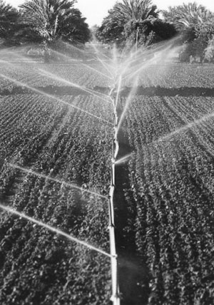
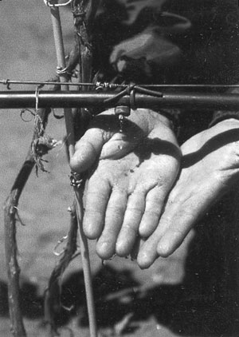
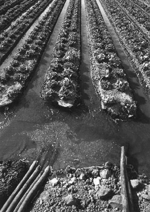

```{r setup, include=FALSE}
library(tidyverse)
knitr::opts_chunk$set(tidy = TRUE, cache = TRUE, echo = FALSE)
options(htmltools.dir.version = FALSE, knitr.kable.NA = "")
```


# Introduction

Soil water is critical to plant growth and development. It is the solvent in which soil nutrients are dissolved before they can be absorbed by plant roots. Once in the plant, water is the medium of transportation of solutes and is required in photosynthesis. Plants lose large amounts of water from their surfaces by the process of transpiration. Soil is the primary source of water for plant use. Soil water also affects soil air and soil temperature and thereby influences plant growth and development. Soil water plays a role in the loss of soil by soil erosion.

Being largely water by weight (more than 90%), fruit cultivation is highly dependent on the availability of water. Further, fruit trees are shallow rooted. Some production areas produce vegetables as rain-fed with some success. However, for optimal yield and highest quality for premium prices, fruit orchard need to be watered at critical times. Also, to prevent summer heat and dessication crops requires additional water for economic production. Therefore, it is worthwhile investing in a reliable irrigation system for fruit production since the industry is generally profitable.

The goal of irrigation is to provide and retain moisture in the root zone of the plant. To be adequate, moisture must be supplied in the right amounts and at the right time. Many horticultural products, crops, and ornamentals require a good supply of water for high yield and quality. High-value crop production often relies on artificial moisture supplementation. For a small garden operation, additional moisture may be delivered by hand carrying it in a variety of receptacles such as buckets and watering cans. A garden hose may also be used for watering garden crops. A continuous moisture supply for a given period is provided by a variety of methods described next, some of which are adaptable to large- and small-scale productions.

# Factors to consider for irrigation

The method of irrigation used in a particular situation depends on the following factors:

*Crop*
\newline The method used to irrigate depends on the type of crop or plant and its water needs, size, and way it is being cultured. Because plants that creep on the ground cannot lie in water, the method of irrigation should not permit water to pond on the soil surface. When growing trees that are spaced widely, it is efficient to supply water to the trees individually rather than watering the large spaces in between plants. Irrigating tall trees from above is difficult. Overhead systems of irrigation are unsuitable for tree irrigation. Certain plants prefer or need large volumes of water to perform well, and the irrigation system should be capable of providing this volume.

*Source of water*
\newline Different sources of irrigation water vary in cost and availability. Certain methods of irrigation (flood) require the entire soil surface to be covered with water. This method is not practical when the source of water is the domestic water supply. It is more suited to water from rivers or other large bodies of water.

*Soil type*
\newline Soils differ in water infiltration rate. If the soil is sandy, the water infiltration rate is high, making the area unsuited to flood irrigation. Much of the water is wasted near the supply source because of deep and rapid infiltration. Water moves slowly over the surface.

*Slope of the land*
\newline Certain irrigation methods require water to be moved by gravity and thus are adaptable to fields in which the ground slopes. 

*Rainfall regime of the region*
\newline In areas of erratic rainfall and low annual totals, moisture must be administered efficiently. The drip system places less demand on the scarce water supply.

*Crop rotation*
\newline If crops rotated in the production system require different land preparation and other cultural practices, a method that is flexible and adaptable should be selected. Not all plants can tolerate flooding. The differences in spacing requirements necessitate a flexible system that can be adjusted readily.

*Surface of the land*
\newline Installation of an irrigation system is affected by the nature of the terrain. Certain methods such as flooding require grading and leveling of the land. Where pumps are needed to lift water, the relief of the area determines the kind of pump needed to move water from the source to the field.

*Cost*
\newline Irrigation methods differ in cost in terms of initial installation and maintenance.

# Methods of irrigation

Irrigation systems for applying supplemental moisture to plants may be grouped into three categories-**sprinkler irrigation**, **drip or trickle irrigation**, and **surface irrigation**. All the methods are used to varying extents in various production regions according to soil conditions, crops being grown, and rainfall patterns. 

## Overhead Sprinkler Irrigation

Water is usually moved under high pressure through a simple or more elaborate network of pipes. A network of pipes is installed underground and fitted with pop-up sprinkler heads to deliver a spray of water to the area (Figure \@ref(fig:sprinkler-irrigation)). It may be as simple as a garden hose sprinkler. There are different designs of this kind of sprinkler, which is easy to use and adapted to irrigating lawns, vegetable gardens, and flower beds. Their use is limited by the length of the hose to which the sprinkler is attached. A perforated hose (porous hose) may also be used to distribute water to plants in the landscape. Watering cans are used for watering flower beds in the absence of sprinkler systems.

```{r sprinkler-irrigation, fig.width=5, out.width="65%"}

```


Sprinkler irrigation is a method of mimicking the rain by supplying moisture from above. Equipment costs can be high. Sprinklers are desirable where soils have high infiltration rates or uneven surfaces. Sprinklers are also used where irrigation is not the primary source of moisture for crop growth. Some overhead irrigation systems are designed to be mobile. A portable system may be transported to the area when needed. Center pivot systems that are equipped with Low energy precision application (LEPA) heads have high water application efficiency and also multiple modes of operation (bubble, sprays, chemigation).

Sprinkler irrigation has the effect of modifying the microclimate of plants, since water has a high specific heat. Sprinkler irrigation is used in the horticultural industry for frost protection in the production of vegetables and fruits in winter.

## Drip or Trickle Irrigation

In methods of irrigation besides drip irrigation, water is applied perhaps also to areas where it is not needed. Drip irrigation is a spot application system for watering plants in which minute amounts of water are applied almost continuously to plants throughout the growing period (Figure \@ref(fig:drip-irrigation)). 

```{r drip-irrigation, fig.width=5, out.width="65%"}

```

Precise water volume is applied to the root zone of the plant. If well designed and managed, its efficiency can be 90-95 percent (i.e., only 5-10 percent of the applied water is wasted). When drip irrigation is used with polyethylene mulch, yield increases can even be increased further. It operates under lower pressure than sprinkler irrigation systems. 

Components required for a effective and efficient drip irrigation system include: water source, pump, sand filter (depending on water source), backflow valve, flow meter, chemical/fertilizer injector and delivery system including, mainline distribution to field, sub-mainline (header line), feeder tubes or connectors and drip lines. The advantages of a drip irrigation system are:

1. Smaller water sources can be used, because trickle irrigation may require less than half of the water needed for sprinkler irrigation.
2. Lower operating pressures mean reduced energy costs for pumping.
3. High levels of water use efficiency are achieved because plants can be supplied with more precise amounts of water.
4. Disease pressure may be less because plant foliage remains dry.
5. Labor and operating costs are generally less, and extensive automation is possible.
6. Water applications are made directly to the plant root zone. No applications are made between rows or other non-productive areas, resulting in better weed control and significant water savings.
7. Field operations, such as harvesting, can continue during irrigation because the areas between rows remain dry.
8. Fertilizers can be applied efficiently through the drip system.
9. Irrigation can be done under a wide range of field conditions.
10. Compared to sprinkler irrigation, soil erosion and nutrient leaching can be reduced.

However, the initial investment is high for this system. Furthermore, it is prone to damage by rodents and is also management intensive. It is economical to use and also highly desirable in areas where the water supply is limited and water cost is excessive. Plastic pipes with emitters are used to deliver the water. These tubes may be laid on the surface of the land or buried, the latter being more prone to clogging. Drip irrigation is especially desirable for high-value crops that require uniform soil moisture for good development. For example, when tuber crops such as potatoes are grown under conditions where the soil experiences fluctuations in moisture levels, tuber formation is irregular, leading to low market value.

## Surface Irrigation

In sprinkler and drip irrigation,a pump may be required for appropriate pressure to move water through pipes. Surface systems depend on the slope of the land to move water. Initial land preparation includes leveling of the land (in flood irrigation) or digging of ditches (in furrow irrigation). These methods are not suitable for sandy soils or soils that have a high infiltration rate, especially if water is to be moved over long distances. Flood irrigation is commonly used in fruit orchards. Furrow irrigation is a version of flood irrigation in which the surface flow is limited to channels between ridges. Vegetables may be irrigated in this way (Figure \@ref(fig:surface-irrigation)).

```{r surface-irrigation, fig.width=5, out.width="65%"}

```


# Popular vegetabe irrigation systems

The design that is widely used in vegetable production is the thin-walled (called tape) plastic tube design. The tubes may be buried in the soil or laid on top of the soil to trickle water. This system is effective but very delicate, prone to clogging and breakage and hence needs to be replaced annually. Vegetables need large amounts of water in production, as previously indicated. The general recommendation is to supply at least 1 inch of water each week to vegetables. Tensiometers may be used to determine when to irrigate (when it reads 20-30 centibars).
