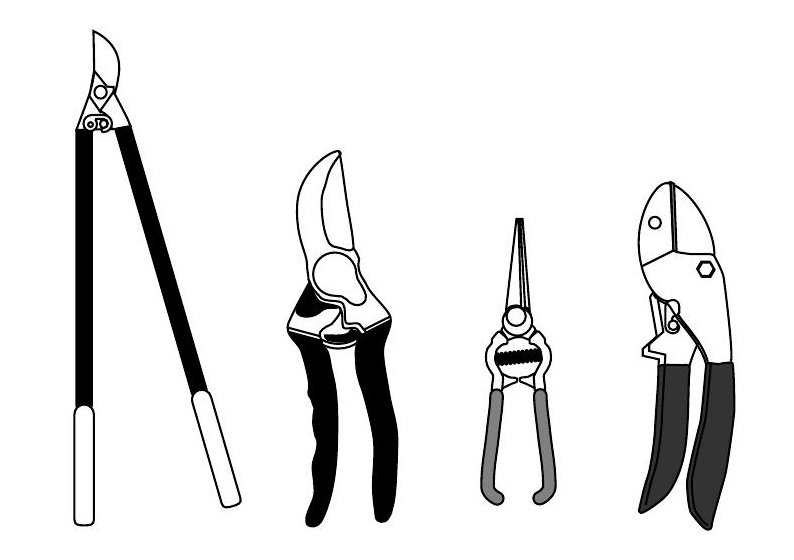

```{r setup, include=FALSE}
library(tidyverse)
knitr::opts_chunk$set(tidy = TRUE, cache = TRUE, 
                      echo = FALSE, fig.width = 5, 
                      fig.height = 4, fig.show = "hold",
                      fig.align = "center", fig.keep='all',
                      out.width='.48\\linewidth')
options(knitr.kable.NA = "")
```


# Introduction {-}

Plants have different growth habits and produce different adult forms. Uncontrolled, plants produce vegetative growth in response to the environmental provisions for growth. Branches form profusely and grow upward in search of light. Strong winds may twist limbs of plants and sometimes even break them off of the stem. 
<!-- The general appearance of plants under such conditions is neither appealing nor productive.  -->
Management of plant growth entails removing excessive and undesirable growth and structures by cutting, a procedure called **pruning**.

Pruning is an art and a science. Manipulating the growth of plants in this way requires an understanding of plant botany and physiology. It is important to know plant structure and growth habits, as well as how plants respond to their environment and to removal of vegetative growth. Pruning is a standard cultural practice in orchards and vineyards, as well as in landscape management. The principles of pruning are generally the same in all situations. However, the specific methods or techniques are varied, depending on the species and the goal of pruning; that is, apples, citrus, grapes, and roses are pruned in different ways.

Pruning is sometimes done in conjunction with another horticultural procedure called training. **Training** is a practice in which tree growth is directed into a desired shape and form. It involves cutting, repositioning, and guiding the course of development of branches and limbs of plants according to a specific objective. During training, limbs may be bent and tied to support structures or even removed altogether, resulting in creative and attractive shapes. 
<!-- In the landscape, aesthetics appears to be more important than productivity, whereas the reverse is true in orchard management. -->

Historically, fruit tree form and structure have been maintained by pruning. Tree training is a more recent technique. It is much more efficient and desirable way to develop form and structure. Training young fruit trees is ideal for proper tree development. It is better to direct tree growth with training than to correct it with pruning. Pruning is most often done during the winter, commonly referred to as dormant pruning. Training includes summer training and summer pruning as well as dormant pruning.

# Training {-}

Although the goal of tree training is to direct tree growth and minimize pruning, specific goals of training a fruit bearing tree include the following:

1. To develop strong branches to bear the weight of fruits.
2. To properly space and retain an appropriate number of branches for enhanced productivity.
3. To control the time of first fruiting. While fruiting should not be delayed, the quality of fruits and the duration of fruiting period are increased when trees. are not allowed to fruit in the early years (three to five years). The heavy weight of fruits may injure young plant limbs and jeopardize productivity in later years.
4. To facilitate production operations such as harvesting, pruning, and spraying.
5. To produce attractive tree shapes, which is particularly important if fruit trees occur in the landscape.
6. To provide physical support for weak stems. In dwarf and semidwarf fruit trees, some kind of support system is needed to aid the tree in bearing the weight of heavy fruits. The limbs may be propped with a notched-end piece of wood.
7. To confine the tree to the space available.

**Forms of training**

1. Central leader training: Characterized by one main, upright trunk, referred to as the leader. Practiced in apple, cherry, pear, plum, etc.
2. Open center or vase training: In this system, the leader is removed, leaving an open center. Practiced in peach, plum, etc.

**Training systems for fruit trees**

Trellis training system: Trellis training involves tying limbs of plants to wires strung between posts or constructed against a wall or fence. Common trellis systems are (Shown in Figure \@ref(fig:training-systems) and \@ref(fig:training-systems2)):

  - Espalier
  - Horizontal espalier
  - Palmette
  - Cordon

```{r training-systems, fig.cap="Cordon system (left) and Kniffen system (right) of training and pruning of fruit trees"}
# pdftools::pdf_convert("E:/DD/Teaching_s/Horticulture Texts/Horticulture - Principles and Practices 4th ed. (intro txt) - G. Acquaah (Pearson, 2009) WW.pdf", format = "jpeg", pages = c(624, 625), dpi = 300)

# produces single caption
knitr::include_graphics(c("./../images/fruits/cordon.jpg",
                        "./../images/fruits/kniffen.jpg"))
```


```{r training-systems2, fig.cap="Horizontal espalier system (left) and Candelabra palmette system (right) of training and pruning of fruit trees"}

knitr::include_graphics(c("./../images/fruits/horizontal_espalier.jpg", 
                          "./../images/fruits/candelabra_palmette.jpg"))
```


# Pruning {-}

Although the manner of pruning varies, the general objectives remain similar. The four general purposes of pruning are:

1. Plant sanitation: Pruning may be undertaken to remove plant parts that create an unsanitary condition, potentially to stop spread of disease/infection.
2. Aesthetics: In ornamental horticulture, the visual appeal of plants is important, especially if plants are in the landscape. Pruning is employed for shaping the form of the plant.
3. Reproduction: Pruning may be undertaken to enhance the reproductive capacity of the plant in several ways.
4. Physiology: Pruning may be employed to manipulate plant physiology in a variety of ways to enhance the performance of a plant.

**Pruning cuts**

Types of pruning cuts:

- Thinning Cut: Removal of an entire shoot.
- Heading Cut: Removal of only the terminal portion of a shoot.
- Bench Cut: Removal of vigorous, upright shoots back to outward growing side branches.

For pome fruit (apple, pear, etc.) and pecans, the fruit are borne primarily on the terminal buds of shoots and spurs (short branches). If many heading cuts are used on these trees the fruit is being removed. However, in most stone fruit the fruit are borne on lateral buds on one-year-old wood and heading cuts are used to stiffen the branches to bear the fruit load as well as to thin the crop to a management level for the coming season.

Broadleaf evergreen fruit trees are pruned only lightly, especially once established. Species such as citrus and avocado are rarely pruned.

Small fruit trees may be trained and pruned to be standard sizes, thereby bearing fruits at a higher level for easy picking. Small fruit trees require some pruning to bear quality, large fruits and have high yield.

<!-- A detailed description of each of the above purpose is stated in Table \@ref(tab:pruning-purposes). -->

```{r pruning-purposes, results="asis", eval=FALSE}
prun_object <- readxl::read_xlsx("../data/fruit_cultivation.xlsx", sheet = "prun_object", 
                  col_names = TRUE, skip = 1)

prun_object %>%
  knitr::kable(caption = "Purposes of pruning", 
               format = "latex", booktabs = TRUE, escape = FALSE, longtable = TRUE) %>% 
  kableExtra::kable_styling(latex_options = c("striped", "repeat_header"), full_width = FALSE, 
                            position = "center", font_size = 11) %>% 
  kableExtra::row_spec(row = 0, bold = TRUE, hline_after = TRUE) %>% 
  kableExtra::column_spec(1:4, "5cm") %>% 
  kableExtra::landscape()
```


# General guidelines for training and pruning {-}

1. Evaluate the whole plant
2. Think before you cut
3. Apical dominance is broken when a stem is cut
4. Pruning invigorates regrowth
5. Pruning can be used to direct growth
6. Timing is critical
7. Pruning can be used to create special effects
8. Use sharp tools and make clean cuts
9. Prune the parts that must be pruned first.

# Tools and equipments for pruning {-}

Most pruning tools are handheld and operated manually. Cuts are made by either sawing or scissor action of cutting tools.

1. **Shears**

- Hand pruners\newline Held in one hand and uses the cutting action design.
- Loopers\newline Designed to cut larger branches (upto 2 inches or 5.2 cm in diameter) by two-handed action. (Figure \@ref(fig:looper-shear))
- Hedge shears\newline Designed for trimming and shaping hedges and ground covers. Electric models are available.

```{r looper-shear, fig.cap="Different types of pruning shears (looper (left), hand pruners and hedge shears)"}
# pdftools::pdf_convert("E:/DD/Teaching_s/Horticulture Texts/Horticulture - Principles and Practices 4th ed. (intro txt) - G. Acquaah (Pearson, 2009) WW.pdf", format = "jpeg", pages = c(595), dpi = 300, filenames = "looping-shear.jpeg")


```

2. **Saws**

A saw may be designed to cut only on the forward stroke and thus make it easier to maneuver when cutting limbs located high on a tree. A saw may also be fine toothed for smooth, close cuts and is especially appropriate for cutting deadwood. Coarse-toothed saws are easier to use on greenwood. Common horticultural saws can be placed into four general categories: manual saws, power saws, pole saws, and pole pruners.

3. **Pruning knife and rasp**

The pruning knife is very sharp and is used when minor pruning involving a few small branches is needed. The knife may also be used to clean and smooth large cut surfaces. A rasp is like a file and is used for shaping or smoothing tree wounds.

4. **Ladders**

Ladders are for extending the reach of an operator during pruning. They should be used with care. They must be set up properly to ensure good stability. Leaning while standing on a ladder should be avoided. Of the different types of ladders available, those most recommended include the following: 

1. Orchard ladder 
2. Extension ladder