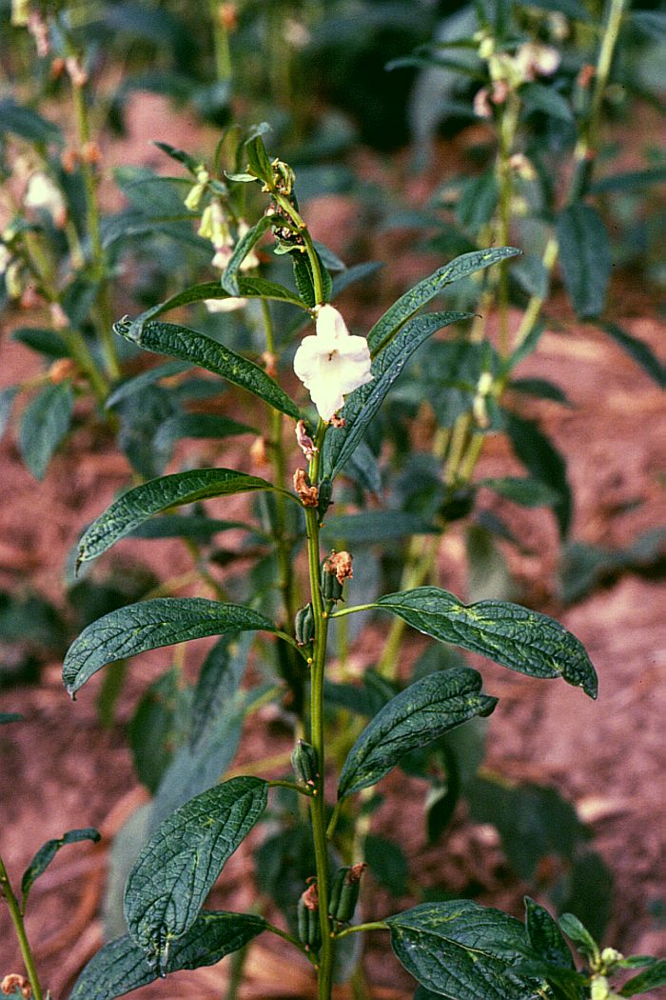

background-image: url("../images/food_crops/Rapeseed3.jpg")
background-size: cover

<br>

.content.vmiddle.center[
# .big[Oilseed crops]
]

.sliderbox.vmiddle.shade_main.center[

### Deependra Dhakal `r anicon::faa('twitter', animate = 'float', rtext='dd_rookie', color='white')` 

### `r anicon::faa('link', animate='vertical', rtext='&nbsp;rookie.rbind.io/contacts', color='white')`
]


---
class: hide-slide-number center middle
background-color: #348931

```{r setup, include=FALSE, echo=FALSE}
require(ggplot2)
require(dplyr)
require(magrittr)
knitr::opts_chunk$set(tidy = TRUE, cache = FALSE, 
                      echo = FALSE, 
                      tidy.opts = list(width.cutoff=50), 
                      eval = TRUE, 
                      fig.show = "hold", fig.align = "center", 
                      fig.asp = 0.6, message = FALSE, warning = FALSE)
options(knitr.kable.NA = "", digits = 3)

```

# What is an oilseed?

---

- Depends on how much oil it is willing to give!

---
background-image: url("../images/food_crops/Rapeseed3.jpg")

# Mustard

*Brassica napus*

---

## Introduction

```{r names-oilseeds, results="asis"}
b_name <- readxl::read_xlsx("../data/oilseeds.xlsx", sheet = "names", col_names = TRUE)
knitr::kable(b_name, align = "c", caption = "Oilseed crops", format = "html") %>%
  kableExtra::kable_styling(bootstrap_options = "striped", position = "center") %>% 
  kableExtra::column_spec(column = 2, italic = TRUE, color = "blue") %>% 
  kableExtra::scroll_box()
```

---

- Domestication took place in Asia
- The leftover meal after pressing out the oil has also been found to be an effective pesticide
- Used in production of biodiesel
- White mustard (*Sinapis alba*) is useful crop for supression of nematodes
- Crops of genus <span class="fragment highlight-red">Brassica</span> are called <span class="fragment highlight-green">cole crops</span>

---

- *B. carinata*, *B. juncea*, *B. oleracea*, *B. napus*, *B. nigra*, and *B. rapa*, all evolved by combination of chromosomes from three earlier species.
- They provide high amounts of vitamin C and soluble fiber and contain nutrients with anticancer properties: 3,3'-diindolylmethane, sulforaphane and selenium.
- Contain modulator of the innate immune response system with potent antiviral, antibacterial and anticancer activity.
- Contain goitrogens
- So what's a <span class="fragment highlight-blue">Mustard</span>?

---

## Botany

```{r rape-flowers, fig.width=5, out.width="60%"}
knitr::include_graphics("../images/food_crops/Brassica_campestris_flower.jpg")

```

---

- The plants and seeds of all brassica oilseeds contain glucosinolates, which are secondary metabolites that serve as chemical protectants.
- In the warmer semitropical regions, *B. juncea* and *B. rapa* predominate
- In cooler temperate regions, *B. napus* and *B. rapa* predominate. 
- Natural hybridization occurs readily between different species.

---

## Climate and Soil

- Grown as winter season crop in Nepal and India.
- Requires $18^oC$-$25^oC$, low humidity.
- Rainfall during flowering is undesirable.
- High RH and rainfall increase incidence of insects and diseases.
- Excessive cold and frost harmful.
- Thrive best in medium or heavy loam soils.
- Sensitive to water logging.
- Good tolerance to saline and alkaline soils.

## Varieties

```{r rapeseed-vars, results='asis'}
rapeseed <- readxl::read_xlsx("../data/oilseeds.xlsx", sheet = "rape_vars", skip = 1)

knitr::kable(rapeseed, align = "c", caption = "Rapeseed varieties released till date", format = "html") %>% kableExtra::kable_styling(bootstrap_options = "striped", position = "center")
```

---
background-image: url("../images/Sesamum_indicum_fruit.jpg")

# Sesame

*Sesamum indicum*

---

## Introduction

```{r sesamum-tax, results="asis"}
structure(list(V1 = structure(c(4L, 1L, 1L, 1L, 5L, 2L, 3L, 6L
), .Label = c("Clade", "Family", "Genus", "Kingdom", "Order", 
"Species"), class = "factor"), V2 = structure(c(7L, 2L, 4L, 3L, 
5L, 6L, 8L, 1L), .Label = c("*S. indicum*", "Angiosperms", "Asterids", 
"Eudicots", "Lamiales", "Pedaliaceae", "Plantae", "Sesamum"), class = "factor")), .Names = c("V1", 
"V2"), class = "data.frame", row.names = c(NA, -8L)) %>% 
  knitr::kable(format = "html", caption = "Scientific classification of Sesamum", col.names = NULL) %>%
  kableExtra::kable_styling(bootstrap_options = c("striped"))

```

---

- Derived from Latin "sesamum" or Greek "sesamon"
- Annual flowering plant, also called *benne*
- Wild relatives occur in Africa and India, with the origin of cultivated *S. indicum* traced India.
- Natural crop of tropical regions, cultivated for its edible seeds, which grow in pods or "buns"
- One of the oldest oilseed crops known
- Oil has nutty flavor, and is ingredient in cuisines across the world
- Often sold decorticated (seed coat removed) for baking

---

## Nutrient composition

```{r sesame-nutr, results="asis", warning=FALSE, message=FALSE}
readxl::read_xlsx("../data/oilseeds.xlsx", sheet = "sesame_nutrient", skip = 1, col_names = TRUE) %>% 
  knitr::kable(col.names = NULL, format = "html") %>% 
  kableExtra::kable_styling(bootstrap_options = "striped")
```

---

## Botany

```{r sesame-bot, out.width="500px"}
knitr::include_graphics("../images/food_crops/Sesamum_gingelly.JPG")
```

---

- Grows 50-100cm
- Has opposite leaves 4-14cm with entire margin; lanceolate, narrowing at the base of the plant to just 1 cm.
- Flowers are yellow, tubular, 3-5cm long with four-lobed mouth; flowers vary in color(white, blue, or purple).
- Seeds occur in many colors.
- Fruit is capsule, normally pubescent, rectangular in section, typically grooved with a short, triangular beak.
- Length of the fruit capsule varies from 2-8 cm.
- Number of loculi varies from 4 to 12.
- Fruit is dehiscent, splitting along the septa.
- Seeds 3-4mm long by 2mm wide, ovate, slightly flattened.

---

```{r sesamum-bot}
knitr::include_graphics("../images/food_crops/Sesamum_indicum_fruit_ts.jpg")


knitr::include_graphics("../images/food_crops/Sesamum_indicum_fruit.jpg")
```

---

## Climate and Soil

- Tolerant to drought-like conditions.
- Adapted to many soil types. Best on well-drained, fertile soils of medium texture and neutral pH.
- Low tolerance to salinity, and water logging.
- Require 90-120 frost free days. Warm conditions above $23^oC$ favor growth and yields.
- Flowering initiation is sensitive to photoperiod, as is the oil content.
- Oil content is inversely proportional to its protein content.
- Rainfall late in the season is particularly harmful (prolongs growth and increases dehiscence loss).

---

## Varieties

```{r sesame-vars, results='asis'}
sesame <- readxl::read_xlsx("../data/oilseeds.xlsx", sheet = "sesame_vars", skip = 1)

knitr::kable(sesame, align = "c", caption = "Sesame varieties released till date", format = "html") %>% kableExtra::kable_styling(bootstrap_options = "striped", position = "center")
```

---

## Field preparation

- Ploughed with tractor twice or 3-4 times with country plough.
- In rice fallows, ploughing done once to retain residual moisture and sown immediately.

## Fertilizer and manuring

---
class: inverse, middle, center
background-image: url("../images/Peanut.jpg")

# Groundnut 

*Arachis hypogea*

---

```{r peanut-full, fig.width=10}

# pdftools::pdf_convert("E:/DD/Teaching_s/Plant Science Stream/Food Crops/Introduction-to-Agronomy-Food-Crops-and-Environment.pdf", 
#                       format = "jpeg", 
#                       pages = 606, 
#                       dpi = 150)
```

---

## Introduction

- Originated either in Africa or Brazil of South America.
- Introduced to other parts of world by the Spanish and Portuguese.
- Dug, extracted, processed and consumed as a snack food, peanut butter, and a candy.
- Seed contains 45-50% oil content.
- Pressed for oil extraction. Oil used for margarine, salad dressings, and cooking oil.
- Cake fed to livestock.
- Manufacture of paint and cosmetics.
- The perennial species (*Arachis glabarata*) is used as a forage legume, or as cover crop.
- Some people are allergic.

---

## Botany 


- Plant is decumbent, with stems extremely inclined, and with the tips raised, reach upto 18 inches in height.
- Pinnately compound leaf with two pair of leaflets.
- Flowers yellow in color, borne in leaf axils of the stems.
- After pollination, the ovary elongates to produce a **peg** that buries the ovary into the soil, which matures and hardens into a shell containing the peanuts.

---

```{r groundnut-bot}

knitr::include_graphics("../images/food_crops/Arachis hypogaea.jpg")
```

---

## Climate and Soil

- Grows best in tropical and subtropical climates, having warm growing-season temperature, adequate rainfall, and long growing season.
- Well-drained, sandy soils that allow formation of the peanut are required.
- Needs about $70-90^oF$ temperature during its growing period with cold nights for maturity.
- Areas receiving well distributed annual rainfall of 500-1250 mm.
- Requires plenty of calcium in soil.
- pH: 5.0-8.5

---

## Varieties

```{r groundnut-vars, results='asis'}
groundnut <- readxl::read_xlsx("../data/oilseeds.xlsx", skip = 1, sheet = "groundnut_vars")

knitr::kable(groundnut, align = "c", caption = "Groundnut varieties released till date", format = "html") %>% kableExtra::kable_styling(bootstrap_options = "striped", position = "center")
```

---

## Land preparation

- Require weed free well pulverized, open and aerated, levelled seed-bed for sowing.
- 2 tills with a local plough, followed by two harrowings and  planking required.
- Fields infested with white grubs need to be remedied with Heptachlor or Chlordane (@25 $kg\ ha^{-1}$) before final harrowing.

---

## Manuring

- Does not require high does of chemical fertilizers.
- FYM/compost
  - Rainfed: 6.25 $ton\ ha^{-1}$
  - Irrigated: 12.5 $ton\ ha^{-1}$
  - 10-20, $P_2O_5$: 40, $K_2O$: 40 $kg\ ha^{-1}$
- Nitrogen applied best as $(NH_4)_2SO_4$ or Calcium ammonium nitrate, P as SSP and K as MOP.
- Nitrogen applied in splits in very light soils.
- Correction for B, Mo, S, Zn and Ca deficiencies by 5 kg Borax, 1 kg Ammonium molybdate, 15-20 kg $ZnSO_4$ and 200-500 kg gypsum per hectare. While others are basally applied gypsum is band placed 30 DAS.
- Gypsum (400 $kg\ ha^{-1}$) applied on second hoeing/interculture (40-45 DAS).

---

## Seed treatment

- Seeds should be free from diseases and of damage.
- Kernels treated with Captan or Thiram (Slurry made by mixing 125 g Thiram/100 kg kernel in 500 ml water)
- Some varieties have a dormancy state, therefore a storage requirement.
- Rhizobium biofertilizer: 
- <small>For 50 kg of kernels, 10% solution of gum Arabic is prepared in water, Jaggary is added to make a solution of 5%. When it dissolves, 2-3 packets (200 g each) of peat based culture is added, groundnut kernels are poured and agitated with the content to make a slurry. As all kernels coat the slurry uniformly, they are spread out on newspaper sheets in the shade.</small>

---
  
## Sowing

- Time of sowing
- <small>Irrigated: April-July</small>
- <small>Rainfed: June 20-July 31</small>
- Seed rate
- <small>Spreading type: 60-70 $kg\ ha^{-1}$</small>
- <small>Bunching type: 85-90 $kg\ ha^{-1}$</small>
- Method of sowing: Either by dibbling the seeds behind the plough or by using a seed drill. In irrigated crops, ridges and furrows and better prepared.

---

- Sowing depth: 5-8 cm in light soils, 4-6 cm in moderate to heavy soils.
- Spacing
- <small>Spreading type or irrigated: 50 cm x 15-20 cm</small>
- <small>Bunching type or rainfed: 20-30 cm x 8-10 cm</small>

---

## Irrigation

- When grown as kharif season crop (April-July): 500-700 mm water.
- At frequency of 8-12 days.
- Critical stages: flowering pegging and pod formation.
- Stopped 20-25 days prior to maturity.

---

## Weed management

- May cause yield reductions to extent of 20-40%.
- First hand weeding on 20-25 DAS, next 15 days later.
- The bunching type should be given a light earthing to facilitate maximum peg penetration into the soil.
- TOK-E-25 or Lasso (5 ltr of commercial material dissolved in 500 ltr water) as pre-emergence soil spray within 2-3 DAS.

---

## Harvesting

- Indicators:
  - Yellowing and shedding of leaves
  - Development of proper color of shell and a dark tint on the inner side of the shells.
  - Usually takes 120-140 days to mature.
- Usually carried out in October-November.
- Bunching types are hand-pulled, spreading types are dug.
- Storage time moisture should not be more than 5%.
- Higher moisture favors fermentation and development of *Aspergillus flavus* mould in the kernel.

---

## Yield

- Irrigated: 3-3.5 $ton\ ha^{-1}$
- Rainfed: 1.5-2.0 $ton\ ha^{-1}$
- Shelling percentage: 70-75%
